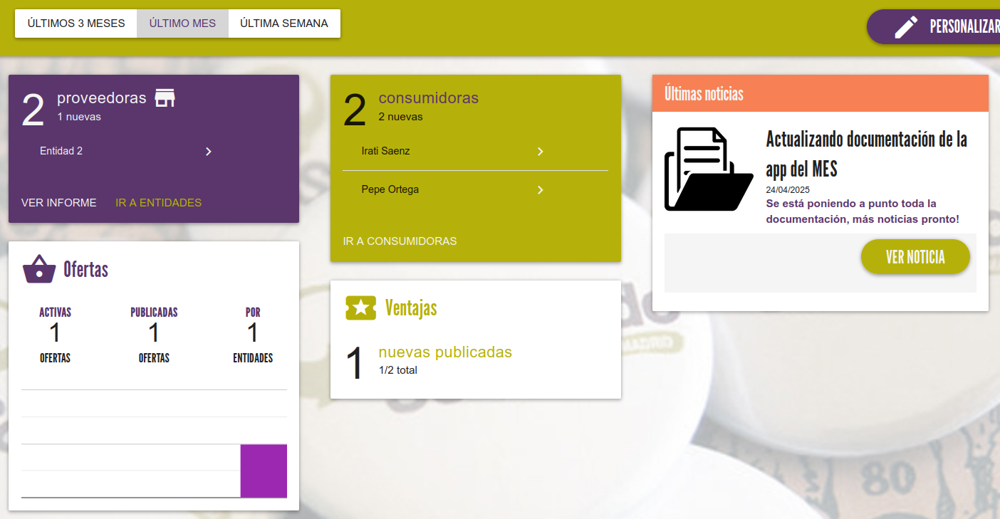
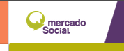

# Acceso

Para acceder al panel de administración del Mercado, tenemos que introducir nuestro email y contraseña (creados al 
añadir el mercado al sistema) en la [pantalla de login](https://mercadosocial.app/login/){ target=_blank }

Lo primero que se nos muestra al acceder es un dashboard o panel de control para tener una visión general del estado
de nuestro mercado:

{ loading=lazy }

Desde aquí podemos ver los diferentes elementos que se crearon en diferentes periodos de tiempo: Últimos 3 meses, último mes,
última semana.

También tenemos algunos botones de atajo a las diferentes secciones.

---

En la esquina superior derecha encontramos el botón `PERSONALIZAR MERCADO` que nos lleva a la pantalla de configuración
de algunos elementos de nuestro mercado como se describe en la sección [Personalizar Mercado](menu_lateral/personalizacion.md)

/// admonition | Volver al panel de control
    type: tip
Para volver en cualquier momento a este panel de control solamente hay que pulsar el logo de "Mercado Social" en la 
parte superior.

{ loading=lazy }
///
