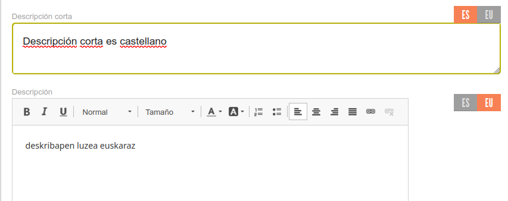

# Idiomas

La aplicación ahora mismo está preparada para insertar traducciones en varias lenguas. Ahora mismo está traducida a 
**castellano** y **euskera**.

Es importante diferenciar dos lugares diferentes donde se pueden ver las traducciones:

- Textos internos de las aplicaciones: Son los textos que van en el propio código de las aplicaciones, tanto la app web
como las móviles de Android e iOS. Cada vez que hay cambios o nuevas funciones en las apps, hay que actualizar tabmién
estos textos.
- Contenidos del mercado: Es la información dinámica que se gestiona desde el panel de administración. Un mercado con
varias lenguas oficiales, se configura al comienzo para editar esos idiomas y a partir de ahí tiene disponibles
pestañas por idioma en los campos traducibles

{ loading=lazy }
 

## Configuración de idiomas de mercado

Ahora mismo esta configuración la hace el equipo de desarrollo a la hora de introducir un nuevo Mercado en el sistema.
La aplicación está preparada para añadir nuevas lenguas como **catalán** o **gallego** en cuanto se solicite y haya 
alguna persona encargada de revisar las traducciones

/// admonition | Importante
    type: warning
El equipo de desarrollo no tiene traductoras de lenguas co-oficiales por lo que cuando hay nuevos textos internos de las
aplicaciones, usamos un traductor automático, pero como no son 100% fiables, se necesita una revisión por parte de una
persona del Mercado correspondiente.
///