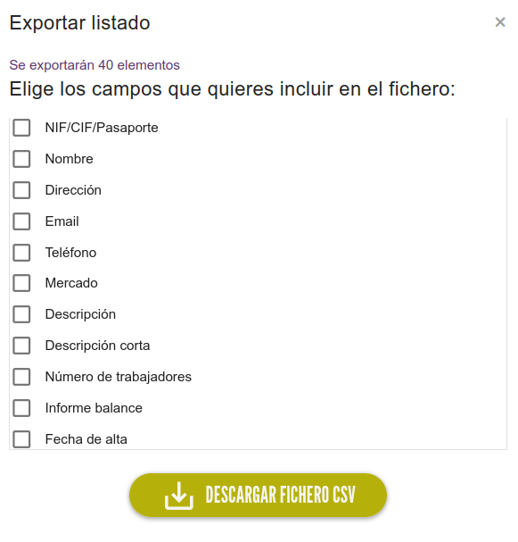

# Exportar datos

En cada uno de los listados de datos encontraremos un botón de :material-briefcase-download: EXPORTAR en la parte inferior derecha de la pantalla
Al pulsar se abrirá una ventana para seleccionar los campos que queremos exportar, si no seleccionamos ninguno se exportarán
todos.

Pulsando :material-tray-arrow-down: DESCARGAR FICHERO CSV se descargará un archivo con formato `.csv` preparado para
abrirse en programas como Excell (Microsoft), Calc (Libre Office) o similares.

{ loading=lazy }

/// admonition | Datos filtrados
    type: tip
El listado de datos que se exporta coincide con el listado que vemos en la web, es importante tenerlo en cuenta si se
están usando los filtros de búsqueda.
///