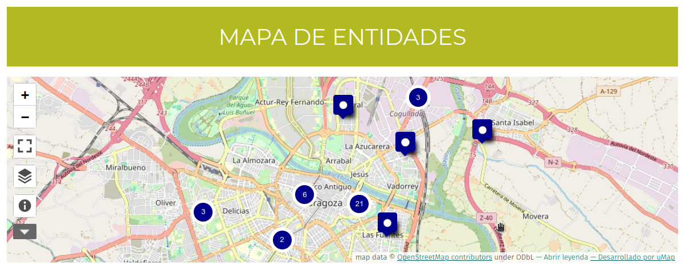

# Mapa

Existe la posibilidad de mostrar las entidades geolocalizadas en un mapa interactivo tal y como está insertado en la 
[web de Aragón](https://mercadosocialaragon.net/mapa-de-entidades/){ target=blank }.

Ahora mismo se hace a través de un servicio de creación de mapas externo open source llamado uMap 
(utiliza los datos de [OpenStreetMap](https://www.openstreetmap.org)) pero está pendiente de hacer una integración más directa en la misma aplicación.

{ loading=lazy }

/// admonition | Integración del mapa
    type: info
Cualquier persona puede configurar un mapa de [uMap](https://umap.openstreetmap.fr/es/) para mostrar las entidades de su 
mercado según se describe en [esta guía](https://wiki.openstreetmap.org/wiki/UMap/Guide/Import_data_files){ target=blank } y 
utilizando el servicio `providers_geojson` del [API](api.md), 
pero si se necesita soporte, se puede solicitar al equipo de desarrollo. 
///
