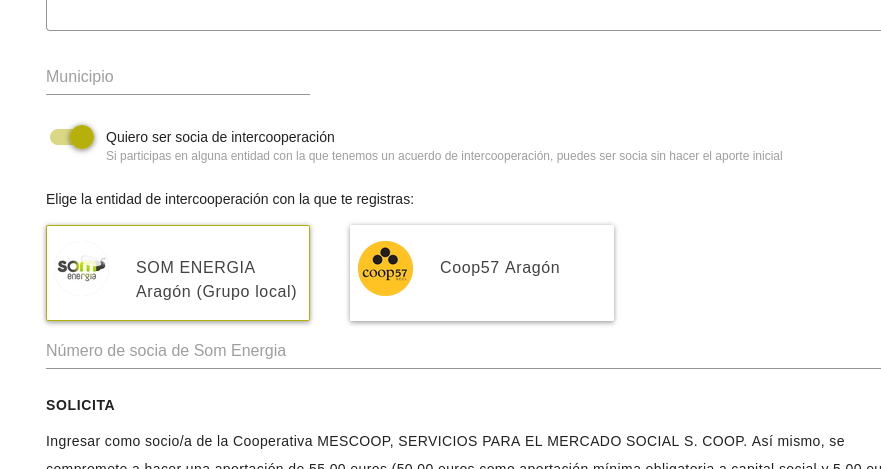
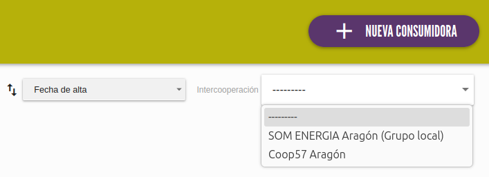

# Intercooperación

Esta función (configurable por mercado) permite gestionar desde la aplicación el alta de socias consumidoras
a través de entidades con las que se tiene un acuerdo de intercooperación. Esto significa que una persona puede
registrarse en el mercado social y acceder a las funcionalidades sin pagar el capital social o aporte inicial porque
ya es socia de otra entidad proveedora de ese mercado con el que se cuenta con un acuerdo de intercooperación.

Esto añade al formulario público de registro para consumidoras un campo desde el que poder seleccionar
la entidad de intercooperación desde la que vienen.

**Importante**: Ahora mismo esta relación de intercooperación se configura relacionando con las
proveedoras de cada mercado. Para casos en los que se llegue a un acuerdo de intercooperación con
alguna entidad que no sea proveedora del mercado (por ejemplo, porque es una organización
que no realiza una actividad productiva), para poder incluirlo habrá igualmente que dar a esta
entidad de alta en el listado de proveedoras, y si no se quiere que aparezcan en el listado público de web y app
se puede marcar para dicha entidad la opción "Oculta en el listado público".

{ loading=lazy }
/// caption
Formulario de nueva consumidora
///

/// admonition | Advertencia
    type: info
Algunos mercados (p.ej. Madrid) utilizan una herramienta de gestión externa desde la que ya controlan
la intercooperación con otras entidades, con formularios personalizados para estas y otras funcionalidades
específicas de sus necesidades. Esta funcionalidad es para los mercados que no cuenten con la herramienta de gestión externa.
///

## :material-cog: Configuración

Esta funcionalidad se habilita desde la página de configuración de cada mercado (necesario tener permisos de 
administración para gestionar las propiedades del mercado), con un selector que se llama "Habilitar funcionalidades de intercooperación".

Cuando habilitamos esta opción:

- Se añade una nueva opción al menú lateral de "Intercooperación"
- En la vista de edición de consumidoras se añaden los campos para gestionar la intercooperación
- En el formulario público para registro de nuevas consumidoras se incluyen los campos para indicar la entidad de intercooperación 
- En el email de administración de nuevas altas se incluyen los campos asociados al nuevo registro
- En el listado de consumidoras se añade un nuevo filtro para mostrar las que vienen de una entidad de intercoop. concreta

{ loading=lazy }
/// caption
Filtro de intercooperación en listado de consumidoras
///

## :material-plus: Añadir entidades de intercooperación

Haciendo click en el botón `+ NUEVA INTERCOOPERACIÓN` accederás a la pantalla para añadir una nueva entidad de intercooperación. 
En esta pantalla se te pedirán varios datos:

  - La entidad concreta: tiene que ser una proveedora ya dada de alta en el mercado
  - Condiciones de intercooperación: Un campo de texto libre para indicar alguna condición concreta que tenga este acuerdo. Se mostrará en el formulario de alta al seleccionar esa entidad (puede dejarse vacío).
  - Identificador de socia externa: Opcionalmente, puede incluírse un campo extra que la nueva socia tiene que rellenar para valir que la relación con la entidad de cooperación existe realmente, por ejemplo el número de socia en esa entidad, o algún código o identificador que la entidad les proporcione.

Una vez rellenados los campos obligatorios, pulsa el botón `CREAR INTERCOOPERACIÓN`.
Desde este momento, esta entidad aparecerá en el selector del formulario de registro de consumidoras y en los
campos, y en los distintos lugares donde se utiliza la intercooperación.

## ::material-view-list: Listado de entidades de intercooperación
Desde la opción de ":material-puzzle: Intercooperación" en el menú lateral accedemos al listado de las entidades con las
que tenemos configurado un acuerdo de intercooperación para alta de socias consumidoras. Pulsando sobre cada fila accedemos
al formulario para editar dicha intercooperación.

En cada fila del listado, además de poder ver el número de consumidoras que se han dado de alta a través de esa intercooperación, tenemos
un par de botones con las acciones que podemos realizar sobre la intercooperación:

* :material-delete: : pulsando este icono podemos eliminar la intercooperación (se muestra un mensaje de confirmación previo)
* :material-walk: : pulsando este icono accedemos a la lista de consumidoras del mercado filtradas por esta intercooperación

/// admonition | Eliminar proveedora asociada
    type: danger
Relacionado con eliminar la intercooperación, si en algún momento se elimina del sistema una proveedora que tenía configurada la intercooperación, 
esta relación de intercooperación no se elimina, guardando una referencia al nombre de la entidad,
para poder mantener la información de intercooperación de las consumidoras. 
///