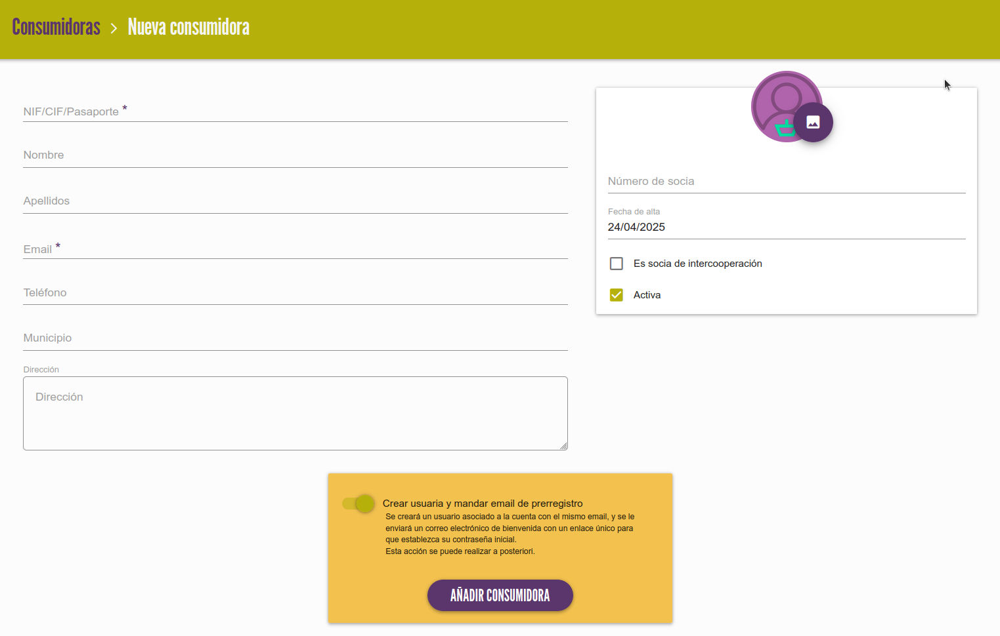
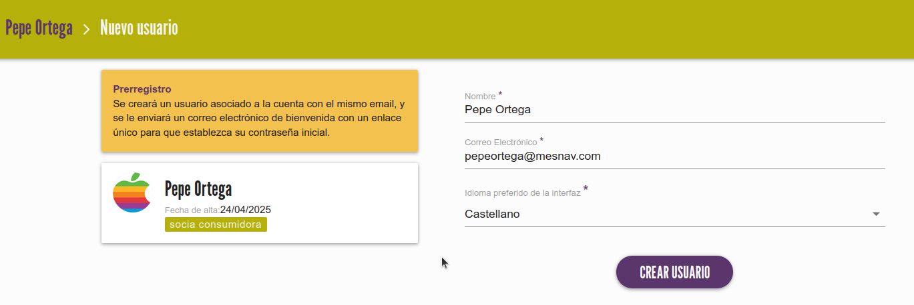

# Gestionar consumidoras

Hay algunos mercados territoriales que además de hacer socias a las entidades proveedoras, permiten que personas particulares
se puedan hacer socias consumidoras del mercado para acceder a ciertas ventajas y crear un vínculo con la red.

Existen 3 formas de dar de alta socias consumidoras:

1. [Panel de administración](#1-panel-de-administracion)
2. [Solicitud mediante formulario público](#2-solicitud-mediante-formulario-publico)
3. [Integración con herramienta externa](#3-integracion-con-herramienta-externa)

## 1. Panel de administración

En el botón superior derecho, hacemos click en `+ NUEVA CONSUMIDORA`, rellenamos sus datos y hacemos click en el botón 
`AÑADIR CONSUMIDORA` en la parte inferior 

{ loading=lazy }

/// admonition | Creación de usuario asociado
    type: info
Antes de añadir la consumidora, tenemos la opción de crear automáticamente su usuario asociado de acceso a la app. 
Si dejamos esta opción marcada, se le enviará un correo a la consumidora para que complete su proceso de registro.

Si solo se quiere crear el registro de la socia de forma interna, porque se quieran completar o validar datos más adelante, o cualquier otro
motivo, mejor desmarcar esa opción. Más adelante se puede volver a crear el usuario como se muestra en esta sección más adelante.
///

## 2. Solicitud mediante formulario público

Los territorios en los que exista un registro público de socias consumidoras tendrán disponible un formulario vinculado
a esta app:
``` 
https://mercadosocial.app/consumer_register/<codigo_de_mercado>
```
/// admonition | Código de mercado
    type: info
El código de mercado es la abreviatura del nombre del mercado. Por ejemplo: mad para Madrid, nav para Navarra, ara para Aragón, etc.
///

/// admonition | Integración en web propia del Mercado
    type: info
Esta dirección se puede incrustar en un elemento `<iframe>` para poder enviar la solicitud desde otros sitios web. 
Para ello habría que hablar con la persona administradora del sitio web del Mercado correspondiente.
///

En este proceso hay 2 pasos:

### 2.1 Envío de la solicitud

La persona interesada, rellena el formulario anterior y lo envía. En este momento la aplicación hace lo siguiente:

1. Se crea un nuevo objeto `consumidora` pero todavía sin usuario asociado.
Esta consumidora estará inicialmente en estado `inactiva` y en el listado de consumidoras se indicará que no tiene
todavía usuario con el icono :material-close-octagon: (al pasar el ratón por encima del icono nos muestra el texto del estado.
2. Se enviará un email a la dirección de correo indicada en el campo `Email de administración` en la configuración del mercado.
En el email se incluyen los datos de la socia y un botón para acceder a la vista de detalle de esta nueva consumidora y poder revisar la solicitud.

### 2.2 Validación

Una vez se haga la revisión según el proceso que siga cada mercado (verificación de datos, comprobación 
de dni adjunto, ingreso del capital social, etc.), ya se puede finalizar el alta de la socia. Para ello hay que seguir estos 2 pasos:

1. Marcar como activa: vamos a la pantalla de edición de los datos de socia (botón `EDITAR` o pulsando el 
icono :material-pencil: en el listado), marcamos la casilla `Activa` y guardamos.
2. Crear su usuario de la app: En la pantalla de detalle de socia, pulsamos `+ CREAR USUARIO` (también podemos hacerlo desde
el listado pulsando :material-account-plus:). En la siguiente pantalla pulsamos `CREAR USUARIO`. Opcionalmente podemos cambiar 
su idioma por defecto (para mercados con varios idiomas)

{ loading=lazy }

/// admonition | Usuarios duplicados
    type: warning
En este punto puede ocurrir que ya exista un usuario con el mismo email (en el mismo mercado u otro diferente), si es así
se muestra un mensaje de error debajo del campo "email". Para desbloquear esta situación, lo primero que tenemos que hacer
es comprobar si exite ese usuario en nuestro mercado en la sección [Usuarios](usuarias.md). Si es así tenemos que asegurarnos
de que no se está intentando dar de alta a la misma persona por error. 

Si no es el caso, lo que sucede es que ese usuario se ha registrado en otro mercado y por requisito del sistema no puede
haber más de un usuario con el mismo email. Tendríamos que contactar con esa socia para que nos de un email alternativo.
///

Si todo ha ido bien al crear el usuario, se enviará automáticamente un correo de bienvenida a la nueva socia con las
instrucciones para completar su registro en la app. A partir de este momento, la socia podrá acceder a su perfil usando 
su email y contraseña.


## 3. Integración con herramienta externa

Hay mercados que tienen su propia herramienta de gestión de socias. Para estos casos se podría desarrollar una integración
entre los dos sistemas para automatizar la creación de socias en esta aplicación. Esto requiere un estudio previo y valoración
para hacer un presupuesto a medida.