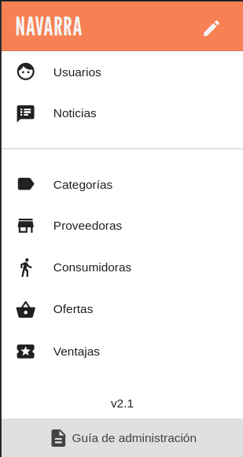

# Menú lateral

{ align=left width=200px loading=lazy }

El Menú Lateral de la aplicación proporciona acceso rápido y sencillo a las distintas secciones del Mercado Social que estás administrando. A continuación, se detallan los elementos presentes en el menú, dispuestos de arriba a abajo:
    
/// admonition | Versión móvil 
    type: info
Si estás en un dispositivo móvil, deberás pulsar el icono :material-menu: para abrir el menú lateral.
///

## Nombre del Mercado Social
En la parte superior del menú, se muestra el nombre del Mercado Social que estás administrando, por ejemplo, "Madrid". Este identificador te permite tener siempre claro en qué contexto te encuentras.
    
## :material-face-man: [Usuarias](usuarias.md)
Esta sección facilita la gestión de usuarias, permitiéndote realizar acciones como añadir, editar o eliminar perfiles de usuarias. Aquí puedes administrar los roles y permisos de las personas que participan en la gestión del Mercado Social.

## :material-newspaper: [Noticias](noticias.md)
En la sección de Noticias, podrás gestionar las novedades y comunicados del Mercado Social. Puedes publicar, editar o eliminar noticias para mantener a las usuarias informadas sobre eventos, actualizaciones y otros acontecimientos relevantes.

## :material-label: [Categorías](categorias.md)
Para la organización de las entidades del mercado, esta sección te permite gestionar las categorías asociadas a las proveedoras. Puedes añadir, editar o eliminar categorías, las cuales son fundamentales para indicar el tipo de servicios ofrecidos o el sector al que pertenecen.

## :material-store: [Proveedoras](proveedoras.md)
En esta sección puedes administrar las entidades proveedoras. Añade, edita o elimina proveedoras para mantener actualizada la lista de participantes.

## :material-walk: [Consumidoras](consumidoras.md)
Aquí se gestiona la información relacionada con las entidades consumidoras. Puedes llevar a cabo acciones como añadir, editar o eliminar perfiles de consumidoras, reflejando así la base de clientes que participan en el mercado.

## :material-basket: [Ofertas](ofertas.md)
La sección de Ofertas te permite gestionar las promociones ofrecidas por las entidades proveedoras. Las ofertas sirven para informar sobre beneficios y descuentos disponibles que ofrecen las entidades proveedoras.

## :material-ticket: [Ventajas](ventajas.md)
En esta área, puedes gestionar las ventajas exclusivas ofrecidas a las personas socias del Mercado Social, tanto proveedoras como consumidoras. Administra las ventajas asociadas a la membresía para fomentar la participación y lealtad en la comunidad.
