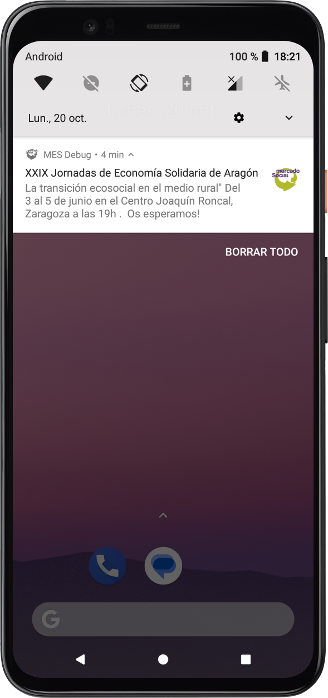
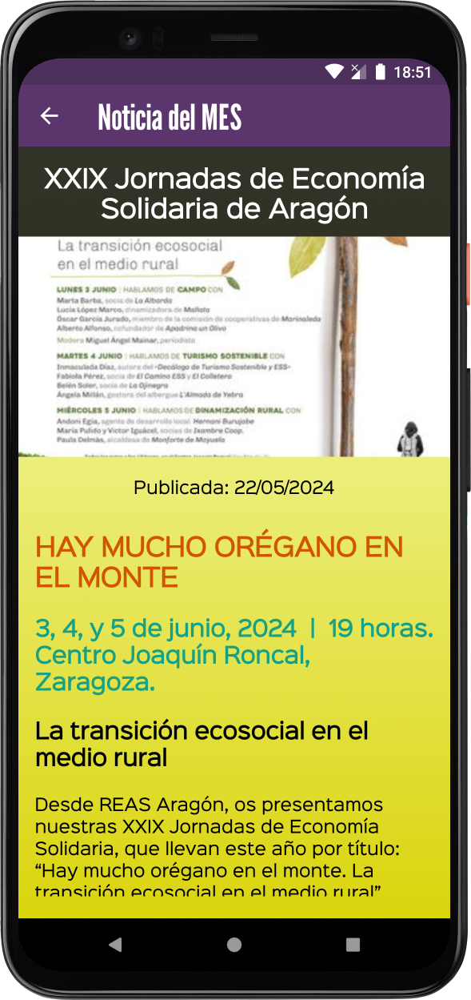
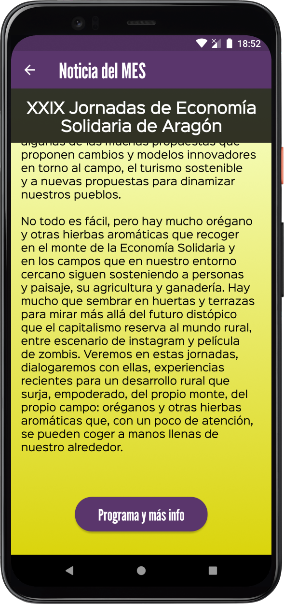
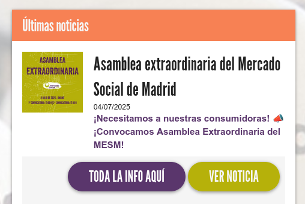

# Noticias

Las noticias son comunicaciones que se mandan desde la organización de cada Mercado. Se puede usar como una herramienta
de comunicación complementaria a la estrategia de comunicación habitual. A las usuarias les llega una notificación 
al móvil y pueden acceder de forma más directa a los mensajes que se quieran mandar.

En la aplicación móvil se ven a través de la sección "Destacados". Esta sección incluye las ofertas que lanzan las entidades, 
junto con las noticias del MES, se ordenan de forma cronológica.

Para ver cómo se muestran las noticias en la app móvil, navega hasta la sección 
[Destacados de la guía de usuario](/docs/user/aplicacion_movil/destacados/)

Acciones de administración:

## :material-plus: Publicar noticia
Haciendo click en el botón "Publicar Noticia" accederás a la pantalla para añadir una nueva noticia. 
En esta pantalla aparecen estos campos:

  - Título de la noticia (multidioma): Aparece en el encabezado de la noticia en la app y en la notificación
  - Imágen de portada de la noticia: Se muestra al abrir la noticia en la app. Se recomienda formato horizontal con un
máximo de 1000px de ancho.
  - URL con más información: Muestra un botón extra al final de la noticia. Al hacer click se abre esta dirección web (URL).
    - Texto del botón de info (multidioma): Texto opcional para mostrar en el botón. Solo visible si se indica una URL de más información. 
  - Descripción corta (multidioma). Se muestra la notificación que llega al teléfono.
  - Descripción larga (multidioma). Se muestra al abrir la noticia en la app móvil.

Una vez rellenados los campos obligatorios, pulsa el botón "Publicar" para enviar la noticia.

Así es como se ve la información de una noticia, por orden: 

- Notificación
- Principio de la noticia en la app
- Final de la noticia con botón

{ loading=lazy   width=230px }
{ loading=lazy   width=230px }
{ loading=lazy   width=230px }

La información de noticias también se ve en los paneles de administración de consumidoras, entidades y administradoras:

{ loading=lazy   width=430px }

## :material-pencil: Editar noticia
Para editar una noticia puedes hacer click en la fila correspondiente a la noticia que se quiera editar, 
o haciendo click en el icono :material-pencil:

## :material-delete: Eliminar noticia
Para eliminar una noticia, haz click en el icono :material-delete: de la fila que quieras eliminar. 
Se te abrirá una ventana de confirmación.