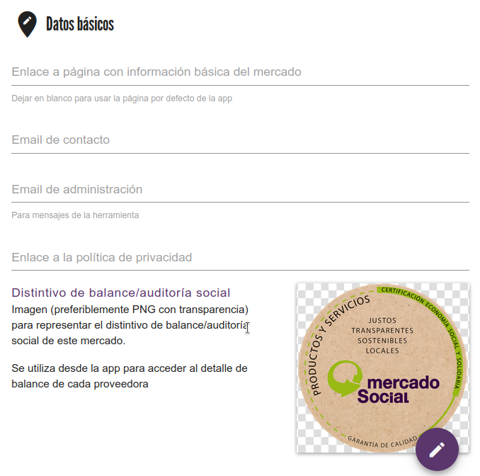
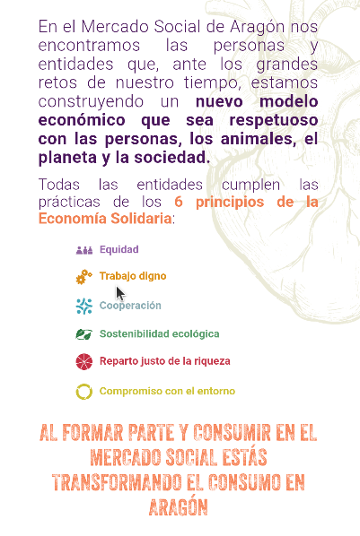
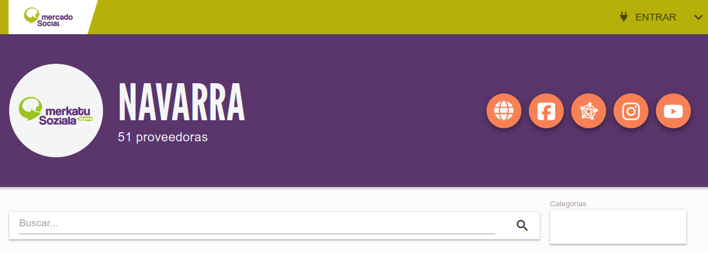
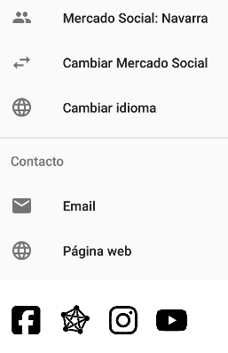
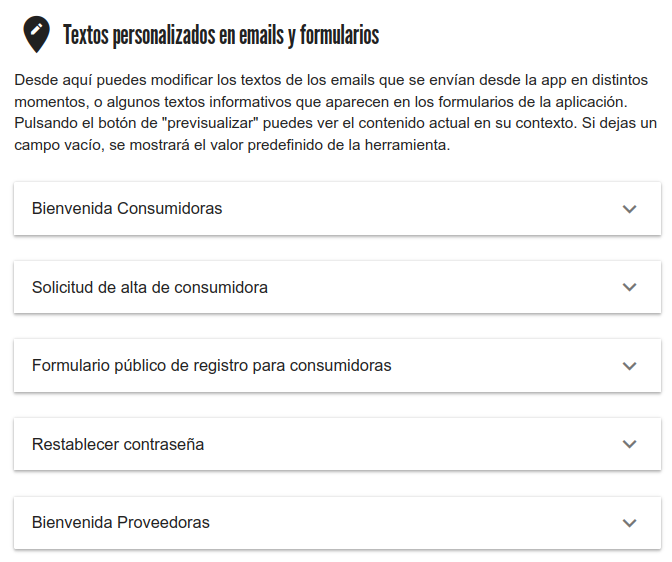

# Personalizar Mercado

En el menú lateral, en la cabecera al lado del nombre del Mercado, tenemos el icono :material-pencil: que nos lleva
a la pantalla de personalizar algunos datos del mercado (también se puede acceder desde el botón `PERSONALIZAR MERCADO` del 
panel de control inicial).

Dentro de esta sección nos encontramos 3 bloques:

## 1. Datos básicos

{ loading=lazy }

En este bloque podremos editar los siguientes datos del mercado:

- Email de contacto: Se mostrará en el menú de la app. Al pulsar se abre automáticamente la aplicación de correo para escribir de forma
cómoda un email a esta dirección de contacto del mercado.
- Email de administración: Este se usa para el envío de correos de la herramienta. Ahora mismo se envían correos en estos casos:
    - Cuando una socia rellena el formulario público de registro. De esta manera se puede revisar la solicitud y continuar el proceso de registro
    - Cuando se crea el usuario de una socia. Como admin, no hay que hacer nada especial aquí, es solo para asegurarse de que 
    le ha llegado el email de bienvenida también a la socia.
- Enlace a la política de privacidad. Necesario solo para mercados que tengan habilitado el formulario público de registro.
Este enlace se mostrará en dicho formulario. Es obligatorio por la Ley de Protección de Datos.
- Distintivo del balance/auditoría social. Es la imagen que se mostrará en la ficha de entidades (tanto en la app como en el listado 
público de la web) que tengan hecho y visible su balance/auditoría social. *(tamaño recomendado 600px, formato cuadrado 
con fondo transparente)*

- Enlace a la página de información básica de mercado: Esta página se muestra en la app móvil. Como se puede ver en esta imagen, 
se trata de mostrar al usuario el objetivo y los valores del Mercado Social de un vistazo.

{ loading=lazy width=40% }

/// admonition | Recomendación
    type: tip
Este campo no es obligatorio, si se deja en blanco aparece el diseño de la imagen anterior, cambiando el nombre del mercado
en la frase del final, pero si se quiere poner una web personalizada, se puede rellenar este campo.
///

## 2. Redes sociales

Enlaces a las redes sociales de cada mercado. Estas aparecen en el listado público de entidades de la web y en las aplicaciones móviles:

{ loading=lazy }
{ loading=lazy width=30% }

/// admonition | Nuevas redes
    type: info
Si se necesita alguna nueva, hay que avisar al equipo de desarrollo
///

## 3. Textos personalizados

Este bloque permite editar a cada mercado ciertos textos que se muestran públicamente según sus necesidades. No es obligatorio
rellenarlos, en cada uno se ofrecen unos contenidos por defecto.

{ loading=lazy }

En cada sección desplegable se ofrece información del contexto de ese texto, los campos editables y un botón para previsualizar 
el texto personalizado.

/// admonition | Previsualizar cambios
    type: warning
Para previsualizar un texto recién editado, primero hay que pulsar el botón `GUARDAR CAMBIOS`
///

/// admonition | Nuevos textos personalizados
    type: info
Si se necesita personalizar nuevos textos en otro lugares, hay que solicitarlo al equipo de desarrollo.
///