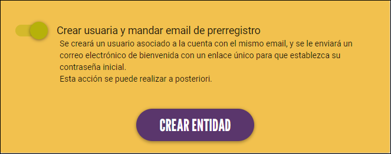

# Proveedoras
Desde esta pantalla podrás gestionar las entidades proveedoras relacionadas con tu Mercado. Éstas se muestran en
la [app móvil](/docs/user/aplicacion_movil/entidades/) y [la web](../../integraciones/web/#1-listado-de-entidades).

## Listado

Aquí podemos ver la lista de de Entidades Proveedoras que tenemos en nuestro mercado. El buscador utiliza los siguientes campos:

- Nombre
- Email
- Número de socia
- CIF
- Dirección

Al lado del logo, se puede ver un icono que indica en qué estado está el usuario asociado para el acceso a la app:

{ loading=lazy} 

- :material-close: Sin usuario. Se ha creado el registro de la proveedora pero sin usuario asociado. Se puede crear más adelante.
- :material-clock-outline: Pendiente de registro. Se ha creado el usuario pero todavía no se ha establecido una contraseña mediante 
- el enlace único que llegó al email de la proveedora.
- :material-check-all: Registro completado. El usuario ha establecido su contraseña y ya puede acceder a la app.

A la derecha de cada fila hay unos iconos para realizar de forma rápida diferentes acciones: 

- Editar proveedora
- Ver ofertas
- Crear o editar usuario (en función de si tiene o no usuario creado)
- Eliminar proveedora. Al hacerlo se eliminará también su usuario asociado si lo tuviera.

## Ver detalles de la proveedora
Para ver en detalle una proveedora, haz click en la fila de la proveedora que quieres consultar. Esto te llevará a otra 
pantalla donde se muestran los detalles principales de la proveedora. Además desde esta pantalla podrás editar los datos
de la proveedora y añadir una ventaja.

Haciendo click en el botón "Añadir nueva" accederás a la pantalla para añadir una nueva entidad proveedora. 
En esta pantalla se te pedirán varios datos referentes a la proveedora divididas en las siguientes secciones:

## :material-pencil: Editar proveedora
Además de a través de la pantalla de detalle anterior, se puede acceder a la pantalla de edición a través el icono
:material-pencil: que está en cada fila del listado.

Los campos de perfil que pueden editar las propias entidades se explican en la sección 
["Mi Entidad" de la documentación de usuaria](/docs/user/panel_gestion/entidades/mi_entidad/#informacion-entidad)

A continuación se muestran los campos de entidad solo editables por administradoras:

  - Número de socia
  - Informe balance/auditoría social: Enlace a la infografía. 

/// admonition | Visibilidad de la Infografía 
    type: warning
Para que se muestre el distintivo que da acceso a la infografía del balance social, tiene que existir un **Número de socia** 
y un enlace válido a la infografía en sus campos correspondientes. Si no se da una de las dos, no se muestra la infografía.
///

- Visibilidad:
    - Activa: Marca el estado de la entidad en el mercado
    - Oculta en listado público: Si por algún motivo se quiere gestionar la entidad de forma interna sin que se vea públicamente.

/// admonition | Redes sociales admitidas
    type: info
Actualmente, las redes sociales admitidas son: Facebook, Fediverso, Instagram, LinkedIn, Pinterest, 
Telegram, TikTok, Whatsapp, X, Youtube. Si se necesitaran otras redes hay que hablar con el equipo de desarrollo.
///

### Crear usuaria asociada a la proveedora

{ align=right width=50% loading=lazy} 
Cuando creamos una entidad proveedora tenemos la opción de crear paralelamente una cuenta de usuaria. 
Si seleccionas esta opción, se enviará automáticamente un correo a la dirección de email de la proveedora, 
desde el cual podrá crear una  contraseña para acceder a la aplicación móvil.

Si no seleccionamos la opción podremos enviar el mail de prerregistro más adelante.
  
Una vez rellenados los campos obligatorios, pulsa el botón "Crear entidad" para crear la entidad proveedoras.

## :material-basket: Consultar ofertas de la proveedora
Para consultar las ofertas de una provedora puedes hacer click en el icono :material-basket: al final de la fila.

También se puede acceder y buscar desde la sección [Ofertas](ofertas.md)

## :material-delete: Eliminar proveedora
Para eliminar una proveedora ponte en contacto con el equipo de administración.

