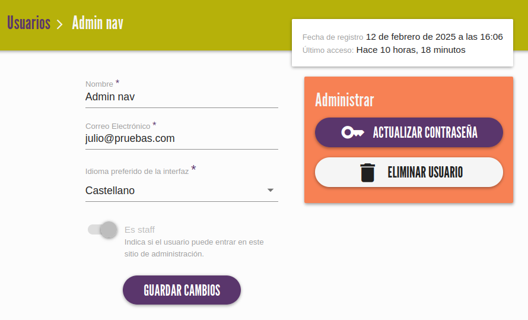
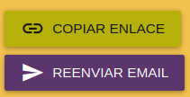
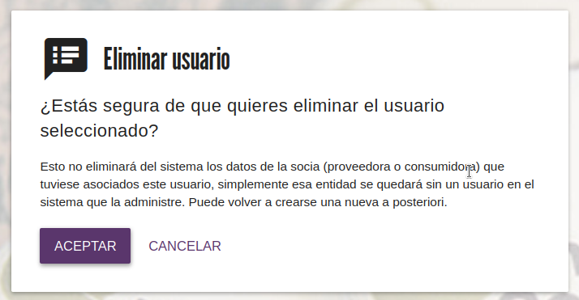

# Usuarios
Esta pantalla muestra la lista de usuarios del mercado. 
Estas cuentas de usuario están relacionadas con el **acceso a la aplicación**, los datos más importantes son el **email y
la contraseña**.

{ loading=lazy} 

Existen dos tipos o roles:

- Normal: Son los usuarios de las consumidoras y proveedoras
- Editor: Para administradoras del mercado

/// admonition | Importante
    type: warning
No confundir `usuarios` con `socias` (consumidoras o proveedoras). En esta herramienta, las `socias` guardan datos
relacionados con su vinculación al mercado correspondiente (nombre, NIF, 
dirección, etc.) y los `usuarios` están relacionados con el acceso a la app (email y contraseña).

Una socia puede tener usuario de la app asociado, pero no es obligatorio.   
///

En resumen, los `usuarios` gestionan el acceso a la aplicación, ya sea como administradora o como socia, y en este último caso
los datos de socia del mercado se gestionan en su sección correspondiente 
([Consumidoras](consumidoras.md) y [Proveedoras](proveedoras.md))

En el listado de usuarios, el icono inicial de cada fila representa lo siguiente:

- :material-clock-outline: Pendiente de registro. Se ha creado el usuario en el panel de admin (más detalles en la siguiente sección), 
pero todavía no se ha establecido una contraseña mediante el enlace único que le llegó al email.
- :material-check-all: Registro completado. El usuario ha establecido su contraseña y ya puede acceder a la app.

## :material-plus: Añadir usuario administrador
Haciendo click en el botón "Nuevo usuario" accederás a la pantalla para añadir una nueva cuenta de **usuario administrador**.

/// admonition | Usuarios de socias
    type: success
Los usuarios de consumidoras y proveedoras se crean automáticamente a través de las secciones correspondientes del menú
///

En esta pantalla se te pedirán varios datos referentes a la usuaria:

  - Nombre
  - Correo electrónico
  - Idioma preferido de la interfaz. Al entrar en su cuenta, por defecto le aparecerá este idioma. En cualquier momento
las usuarias pueden cambiarlo a través del menú de perfil (arriba a la derecha)

Al crear una nueva usuaria, se le enviará un correo electrónico de bienvenida con un enlace único para que establezca 
su contraseña inicial. 

## :material-pencil: Editar usuario

Para editar una usuaria puedes hacer click en la fila correspondiente a la usuaria que se quiera editar, o haciendo 
click en el icono :material-pencil:.

{ loading=lazy} 

/// admonition | 
    type: tip
Esta sección es útil cuando alguna persona pide ayuda para recordar su email de registro o resetear su contraseña.
///

{ align=right width=30% loading=lazy} 
Si un usuario todavía no se ha registrado en la app, le aparece este recuadro que hemos llamado `Preregistro` donde se le
puede reenviar el email con las instrucciones de registro en la app o copiar el enlace para enviarlo manualmente.

## :material-delete: Eliminar usuario
Para eliminar un usuario, puedes hacerlo de dos maneras: 

- En el listado de usuarios, pulsando el icono :material-delete: de la fila que quieras eliminar. 
- En la pantalla de edición de usuario, pulsando el botón `Eliminar usuario`
 
En ambos casos se abrirá una pantalla de confirmación.

{ loading=lazy} 

Como indica el mensaje, eliminar un `usuario` vinculado a una `socia`, no elimina los datos de la socia. Si se quiere eliminar 
completamente una socia consumidora o proveedora, hay que hacerlo desde su sección correspondiente en el menú.