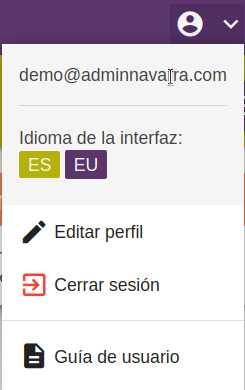

# Perfil
{ align=right width=50% loading=lazy} 

Haciendo click en el botón que tiene el icono :material-account-circle: en la esquina superior derecha accedemos a la siguiente información:

##:fontawesome-solid-pen: [Editar perfil](#editar-perfil_1)
##:material-exit-to-app: [Cerrar sesión](#cerrar-sesion_1)

 

# Editar Perfil
Seleccionando la opción de editar perfil se abrirá una nueva pantalla donde podremos modificar información relacionada con nuestro perfil, como:
- Idioma preferido de la interfaz
- Actualizar contraseña

# Cerrar Sesión
Seleccionando la opción de cerrar sesión, la aplicación finalizará la sesión con la cuenta actual y nos redigirá a la pantalla de inicio de sesión.