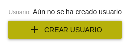

# Registro de socias

El registro en la app del Mercado Social se realiza en tres fases:

1. [Solicitud de prerregistro](#1-solicitud-de-prerregistro)
2. [Prerregistro](#2-prerregistro)
3. [Registro](#3-registro)

## 1. Solicitud de prerregistro
/// admonition | Socias
    type: warning
De momento esta opción está únicamente disponible para socias consumidoras. Para dar de alta a otro tipo de socias deberá 
hacerse desde el panel interno usando una cuenta con permisos de administración del mercado.
///

La solicitud de prerregistro se puede realizar de manera abierta por cualquier persona que quiera hacerse socia consumidora del Mercado Social.
Para ello, habrá que navegar a la siguiente dirección:
``` 
https://mercadosocial.app/registro/<codigo_de_mercado>
```
/// admonition | Código de mercado
    type: info
El código de mercado es la abreviatura del nombre del mercado. Por ejemplo: mad para Madrid, nav para Navarra, ara para Aragón, etc.
///

/// admonition | iframe
    type: info
Esta dirección se puede incrustar en un elemento `<iframe>` para poder enviar la solicitud desde otros sitios web.
///

Al completar el fomulario de solicitud, ocurriran dos cosas:

1. Se creará un nuevo objeto `consumidora` dentro del mercado social indicado en el *código de mercado*.
Esta consumidora estará inicialmente en estado `inactiva` y en el listado de consumidoras se indicará que está *Pendiente de registro*.
2. Se enviará un email a la dirección de correo indicada en el campo `Email de administración` en la configuraciónd el mercado.
En el email se incluye un botón para acceder a la vista de detalle de esta nueva consumidora y poder revisar la solicitud.


## 2. Prerregistro
{ align=right width=50% loading=lazy} 

Una vez creada la socia (ya sea a través de una solicitud de prerregistro, o directamente desde la pantalla de consumidoras o proveedoras) podremos acceder a la pantalla de detalle de dicha socia.

En esta pantalla podremos revisar la información proporcionada por la socia y si todo está correcto pulsaremos el botón `+ CREAR USUARIO` que se muestra en la parte superior derecha.

Mediante este botón crearemos una cuenta de `usuario` asociada a dicha socia. Además, se enviará un correo de bienvenida a la socia con un enlace único para que establezca su contraseña inicial. 

## 3. Registro
Una vez que la socia reciba el correo de bienvenida y establezca su contraseña, se completará el registro en la app. A partir de este momento, la socia podrá acceder a su perfil usando su email y contraseña.
