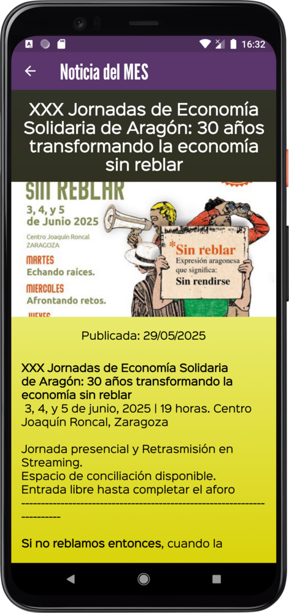

# :material-bullhorn-variant-outline: Destacados

Esta es la sección pensada para estar al día de las novedades de nuestro Mercado Social. Cuando se envía una nueva, llega también
una notificación al teléfono para avisarnos de las novedades. Aquí veremos 2 tipos de publicaciones:

- **Noticias del MES**: enviadas por la organización para difundir eventos, convocatorias y otros mensajes importantes
- **Ofertas de entidades**: para promocionar sus productos o servicios. A diferencia de las Ventajas que son permanentes y para socias, 
las ofertas son abiertas y tienen una duración determinada marcada por la fecha de validez.

{ loading=lazy align=left  width=330px }
{ loading=lazy align=left  width=330px }

