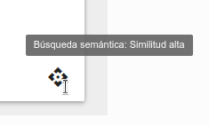
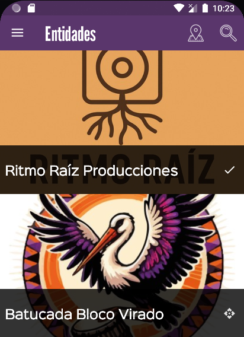
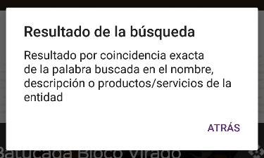

# :material-comment-search-outline: Búsqueda semántica

Esta función mejora notablemente los resultados de búsquedas de usuarias ya que no solo realiza búsquedas por palabras exactas 
si no que permite encontrar entidades por
aproximaciones de significado de las palabras descritas en el campo "Productos y servicios", por ejemplo si una zapatería
ha puesto la palabra "Zapatos" entre sus productos y un usuario busca palabras similares como "zapatillas" o "calzado", 
esta zapatería aparecerá en la lista de resultados, posicionada por orden según su aproximación semántica y con un 
indicador de esa proximidad. En el modelo anterior de búsqueda por palabras exactas, esta entidad no aparecería entre los
resultados al no haber una coincidencia completa de palabras.

/// admonition | Explicación técnica
    type: info
Esta "magia" es posible gracias a lo que se conoce técnicamente como [modelos de embedding](https://es.wikipedia.org/wiki/Word_embedding){ target=blank }
, que en resumen transforman palabras a números (este proceso se llama vectorización) que representan su posición semántica en un 
espacio multidimensional y permiten calcular la "distancia" o similitud frente a otras palabras.
///

## Algoritmo de búsqueda

Esta búsqueda por similitud semántica no excluye la búsqueda anterior por palabras exactas si no que se hace una combinación 
según este algoritmo:

- Búsqueda por palabras exactas en los campos de entidad: `nombre, descripción corta, descripción completa y productos/servicios`
- Búsqueda por similitud semántica en el campo `productos/servicios`
- Los resultados se ordenan mostrando las coincidencias por palabras exactas en primer lugar, seguido de los resultados por 
similitud semántica ordenados por dicha similitud. 
- En ambos casos se muestra una vista que indica si el resultado viene de búsqueda exacta o su proximidad semántica.

/// admonition | Optimizar las búsquedas
    type: tip
El campo más importante para optimizar las búsquedas es el de Productos y servicios, consulta las recomendaciones
 de edición de este campo en la [sección Mi Entidad](panel_gestion/entidades/mi_entidad.md#productos-servicios).
///

## Visualización de resultados

La búsqueda semántica funciona tanto en la web como en las aplicaciones móviles y muestra dos símbolos diferentes para
indicar el tipo de resultado: un check para coincidencias exactas de palabras y un rombo para resultados por similitud semántica.

Así se muestra:

### Web

{ align=right }
Al pasar el cursor del ratón por encima se muestra el grado de similitud: Alta, media o baja

  
### Aplicación móvil

{ align=right }
Al pinchar en cada uno de los iconos, se muestra una breve explicación del resultado:
