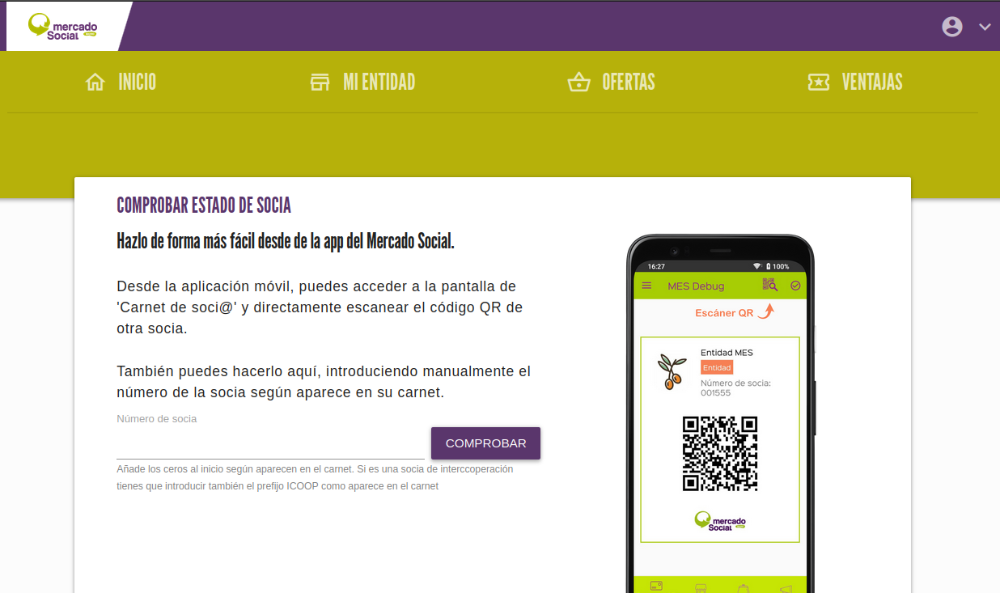

# :material-card-account-details-outline: Carnet de socia

Para las entidades, existe una función especial para comprobar la validez de una socia en el mercado. Esto es útil
para saber a quien aplicar una ventaja o descuento por ejemplo. 

Esta operación se puede hacer también desde la app móvil, 
pero si fuera más cómodo en la web también se puede introducir directamente el número de socia a validar

{ loading=lazy }

De forma similar a las consumidoras, se tiene acceso a su carnet en formato digital y para descarga en PDF
imprimible.

{ loading=lazy }

 
