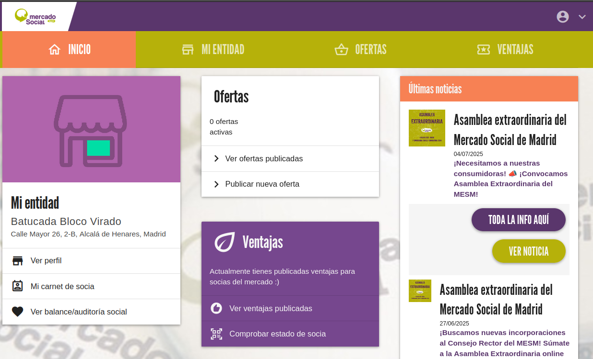

# :material-store: Entidades

Las entidades podrán realizar las siguientes operaciones en su panel de gestión:

- Ver y modificar su toda la información pública de su entidad
- Ver y publicar nuevas ofertas. Al publicar una oferta, llega una notificación de aviso a los teléfonos
- Comprobar el estado de una socia para aplicar ventaja o descuento si está activa
- Ver el carnet digital y descargarlo en pdf imprimible
- Ver su balance social
- Ver las últimas noticias del mercado
- Ver las ventajas que ofrecen a socias (para modificarlas hay que escribir un correo a la administración del mercado ya
que pasa por un proceso de revisión)

En el momento de acceder al panel se muestra la siguiente pantalla con accesos a todas las secciones
{ loading=lazy }

