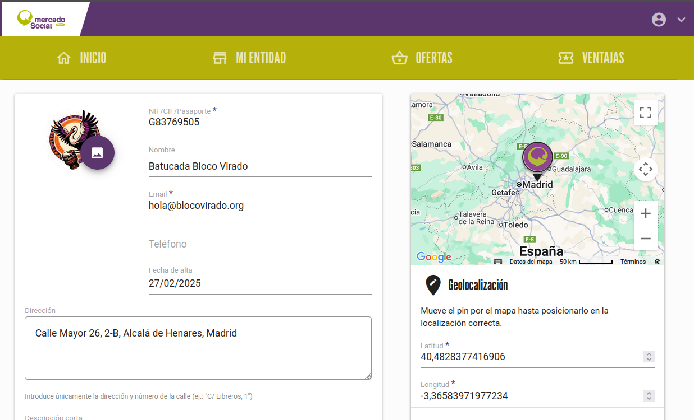
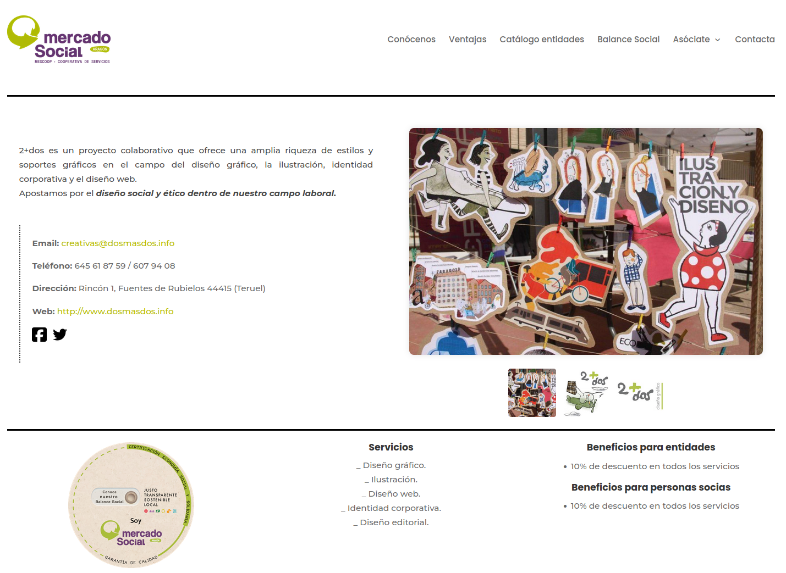

# :material-store-outline: Mi entidad

Aquí podrás ver y modificar la información de la entidad

{ loading=lazy }
{ loading=lazy }

 
### Campos de información

  - Foto de perfil / logo (tamaño recomendado: máximo 600px de ancho, formato cuadrado)
  - NIF/CIF/Pasaporte: No se muestra de cara al público pero es importante para la gestión interna del mercado
  - Nombre (campo multidioma): Es el nombre comercial que se ve de cara al público, no tiene por qué coincidir con la razón social
  - Email: para contacto público
  - Dirección postal
  - Descripción corta o slogan (campo multidioma). Se recomienda un máximo de 80 caracteres
  - Descripción (campo multidioma). Se recomienda una descripción completa pero breve, no más de 2 o 3 párrafos.
  - Productos y servicios (campo multidioma). Ver caja de explicación más abajo.
  - Categorías a las que pertenece. [Ver cómo gestionar categorías](categorias.md)
  - Número de personas trabajadoras
  - Galería: Fotografías de la entidad (tamaño recomendado: máximo 1000px de ancho, formato horizontal). La primera de las
imágenes de esta galería será la que se muestre en el listado de la app.
  - Geolocalización: Usa el mapa interactivo para colocar el pin en la localización donde se encuentra la entidad. 
Esta localización será visible en el mapa general.
  - Redes sociales

/// admonition | Productos y servicios
    type: tip
Este campo es el más importante para la [búsqueda semántica](../../busqueda_semantica.md), la forma óptima de completarlo 
para optimizar las búsquedas es enumerar en diferentes líneas los productos y servicios principales, ordenados por 
importancia y lo más escueto posible.

Por ejemplo para una entidad de diseño gráfico, se podría rellenar así:

Diseño gráfico 
Ilustración 
Diseño web 
Identidad corporativa 
Diseño editorial 

///

Esta información se muestra de la siguiente forma en estos lugares:

## Página web

{ loading=lazy }
Más información en la sección [Web pública](../../../web_publica/)

## App móvil

{ loading=lazy align=left  width=300px }
{ loading=lazy align=left  width=300px }

 

Más información en la sección de [Entidades en la app](../../../aplicacion_movil/entidades/)

## Diseño propio

Existe la posibilidad de obtener los datos de entidades en bruto a través del [API](/docs/admin/integraciones/api/).

De esta manera, una persona especializada en diseño web puede crear pantallas de información personalizadas a través de
los datos que las entidades o administradoras gestionan en esta herramienta.

Es el caso por ejemplo del [Mercado de Aragón](https://mercadosocialaragon.net/catalogo-entidades/){ target=blank }, 
donde han hecho un diseño propio en su web:

{ loading=lazy }