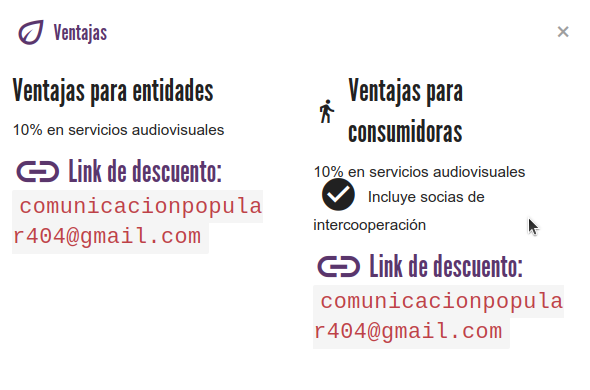

# :material-ticket: Ventajas

Son los beneficios que ofrece tu entidad a las socias del mercado social. Es opcional, pero se anima a las entidades a ofrecer
alguna ventaja/descuento a socias para incentivar el consumo dentro de la red de economía solidaria.

{ loading=lazy }

Para ofrecer una nueva ventaja o editar alguna existente debes escribir al email de contacto de tu mercado,
ya que requiere una valoración previa. Este email se te mostrará claramente en la sección correspondiente de tu panel.

Así se mostrarán tus ventajas en los distintos lugares:

## Web
{ loading=lazy }

## Móvil
{ loading=lazy width=300 }
