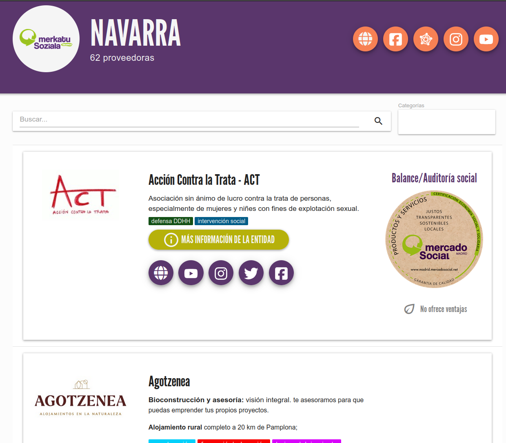

# :material-web: Web pública

La dirección web principal de la app del MES es:

### [mercadosocial.app](https://mercadosocial.app){ target=blank }

Desde ahí podemos ver la información general del proyecto, entrar en nuestro [panel de gestión](panel_gestion/index.md) y navegar por las entidades de los mercados 
que están actualmente dentro de la app:

{ loading=lazy }

Al entrar en uno de ellos (por ejemplo [Navarra](https://mercadosocial.app/d/nav/){ target=blank }), podremos ver la lista de entidades,
buscar por nombre, categorías o productos y servicios a través de la [búsqueda semántica](busqueda_semantica.md)

{ loading=lazy }
